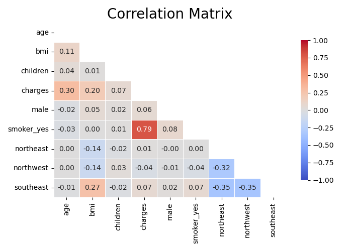
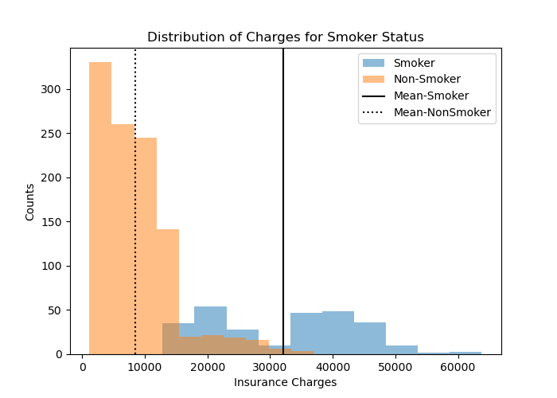
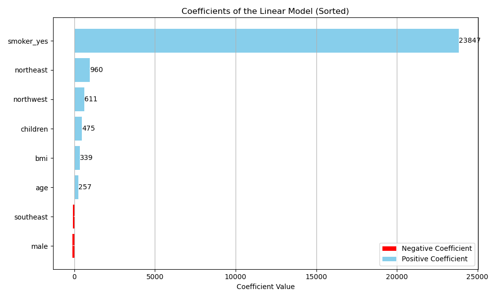
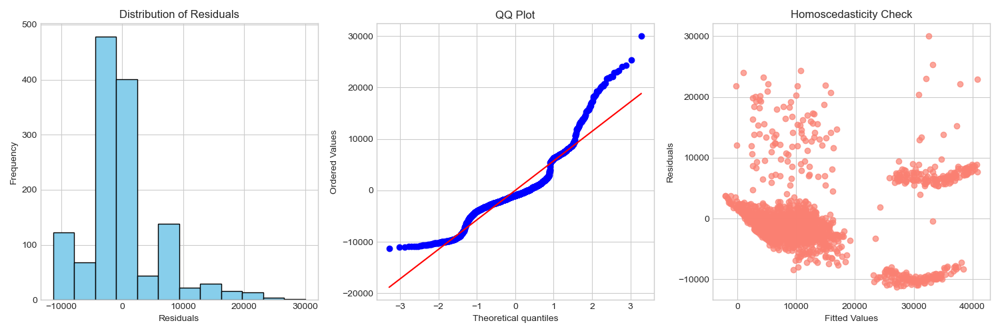

# Predicting Medical Insurance Costs
 

## Dataset

The dataset for this project can be found on [Kaggle](https://www.kaggle.com/datasets/teertha/ushealthinsurancedataset)

## Objectives

The main objective of this project is:

> ** To clean and analyze the dataset and generate a linear model to predict insurance costs based on patient demographics.

To achieve this, the objectives are futher broken down into 3 sub-objectives
1. Main Insights: Perform exploratory data analysis of the dataset and report key findings
2. Model Training: Train a Linear Model and analyze the significance and impact of its coefficients
3. Evaluation: Analyze the residuals and suggest model improvements

## Main Insights

During our exploratory data analysis, we uncovered several noteworthy insights. While examining for multicollinearity among variables, our correlation matrix revealed a strong positive correlation between smoking status and increased insurance charges. This suggests that individuals who smoke tend to have higher medical insurance costs compared to non-smokers.




Additionally, we observed other interesting associations in the correlation matrix. For instance, there was a positive correlation between BMI and living in the southeast region, as well as between insurance charges, BMI, and age. These associations provide valuable insights into potential relationships between different variables in our dataset.



To delve deeper into the impact of smoking on insurance charges, we visualized the difference between smokers and non-smokers using a histogram. The distributions of insurance charges for smokers and non-smokers exhibited distinct patterns, with smokers displaying a higher insurance costs with higher variability. Furthermore, the means of both distributions were notably different, indicating a significant disparity in insurance charges between the two groups. This visual evidence strongly suggests that smoking status is a significant factor contributing to increased medical insurance costs.

To quantitatively assess the difference in insurance costs between smokers and non-smokers, we conducted a two-sample t-test (two-tailed) comparing the means of the two populations.

$H_0$: There is no difference between these two populations. $\mu_a = \mu_b$

$H_1$: There is a difference between these two populations. $\mu_a \neq \mu_b$

Significance Level $\alpha$ = 0.05

```shell
Smoker Insurance Mean: 32050.23
Non-Smoker Insurance Mean: 8440.66
t_statistic: 46.64479459840305
p_value: 1.4067220949376498e-282
Reject the Null Hypothesis, the test is significant (p-value < 0.05)
```

The results of the test led us to reject the null hypothesis, providing strong evidence that smoking status is indeed a significant determinant of insurance charges. Consequently, we anticipate that smoking will have a high linear coefficient in our regression model, reflecting its substantial impact on insurance costs.


## Model Training 

A linear model was trained to predict medical insurance charges using the statsmodels library. 

```shell
             Coefficient  T-Statistic       P-Value   P-value < 0.05
age           256.764611    21.554732  1.324461e-88      Significant
bmi           339.250364    11.857229  6.721670e-31      Significant
children      474.820486     3.443299  5.925434e-04      Significant
male         -129.481478    -0.388606  6.976303e-01  Not Significant
smoker_yes  23847.328844    57.693117  0.000000e+00      Significant
northeast     960.081385     2.008093  4.483556e-02      Significant
northwest     610.854854     1.278587  2.012658e-01  Not Significant
southeast     -75.184216    -0.159691  8.731486e-01  Not Significant

R-Squared = 0.751

```



Based on the linear regression model we constructed, we found that the model has an R-squared value of 0.751. This indicates that approximately 75% of the variability in medical insurance charges in our dataset can be explained by the predictors included in the model. In other words, our model captures a significant portion of the variance in insurance charges, suggesting that it provides a reasonably good fit to the data.

One of the key predictors that emerged from our analysis is smoking status. We observed that smoking has a high coefficient in the model, and its associated p-value is statistically significant. This suggests that smoking status is a strong predictor of higher insurance charges. Individuals who smoke tend to have significantly higher insurance charges compared to non-smokers, after accounting for other factors included in the model.

On the other hand, factors such as gender (male) and geographical region (specifically living in the northwest or southeast regions) were found to be non-significant based on their p-values. This implies that these variables do not have a statistically significant impact on insurance charges in our model. As a result, we may consider dropping these variables from the model in order to optimize its predictive performance further. By removing non-significant predictors, we can potentially simplify the model without sacrificing its explanatory power, leading to a more parsimonious and interpretable model.

## Evaluation




Upon examining the histogram of model residuals, we observed that the distribution appears to have a right skew. This suggests that the residuals are not perfectly normally distributed and may contain outliers or systematic deviations from the model's predictions.

Furthermore, when inspecting the probability plot, we noticed deviations from the straight line pattern, particularly in the tails of the distribution. This deviation indicates that the distribution of residuals may have heavier tails than a normal distribution, implying that extreme values occur more frequently than expected under normality assumptions.

In addition, our homoscedasticity plot revealed an interesting pattern. As the values of the predictor variable (X) increase, the variance of the residuals appears to spread out more. This phenomenon suggests that our model's predictions become less reliable for higher insurance costs. In other words, while our model may perform well for moderate insurance charges, its predictive accuracy diminishes as the insurance costs increase.