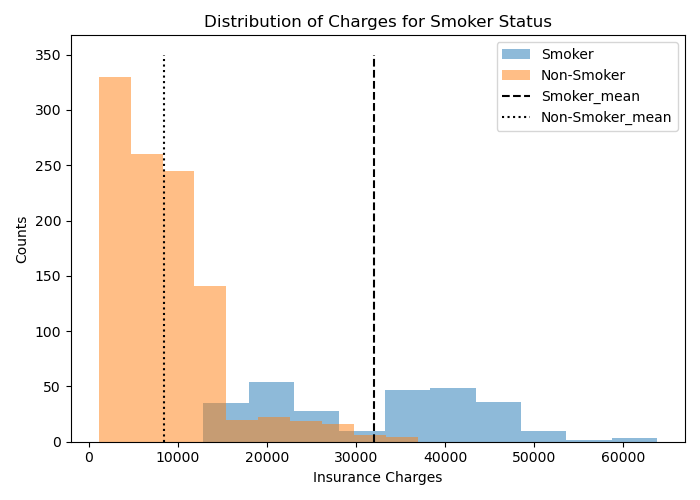

# Predicting Medical Insurance Costs
 

## Dataset

The dataset for this project can be found on [Kaggle](https://www.kaggle.com/datasets/teertha/ushealthinsurancedataset)

## Objectives

The main objective of this project is:

> ** To clean and analyze the dataset and generate a linear model to predict insurance costs based on patient demographics.

To achieve this, the objectives are futher broken down into 3 sub-objectives
1. Perform exploratory data analysis of the dataset 
2. Train a Linear Model
3. Evaluate/improve the Model

## Main Insights

From the exploratory data analysis, we found some interesting insights.

While exploring for multi-colinear variables, our correlation matrix reveals that being a smoker is highly correlated with increased insurance charges:


There are other interesting associations in the matrix such as BMI being positively associated with a southeast region and insurance charges being positively correlated with BMI and age. To further explore the effect of smoking on insurance charges we visualized the difference between smoking and non-smoker on a histogram



The associated insurance charges for Smokers has a higher variability overall (the insurance changes are more spread). The distributions of the two categories is visually distinct. There is only a small overlap of values and the means of both distributions are quite far apart. This is good indication that being a smoker has a significant likely-hood of increasing medical insurance costs. 

We ran a two-sample t-test (2 tail) compare the medical insurance costs of these two populations.

$H_0$: Smoking does not increase medical insurance costs. $\mu_a \leq \mu_b$

$H_1$: Smoking increases medical insurance costs. $\mu_a > \mu_b$

Set alpha to 0.05

```shell
Smoker Insurance Mean: 32050.23
Non-Smoker Insurance Mean: 8440.66
t_statistic: 46.64479459840305
p_value: 1.4067220949376498e-282
Reject the Null Hypothesis, the test is significant (p-value < 0.05)
```
