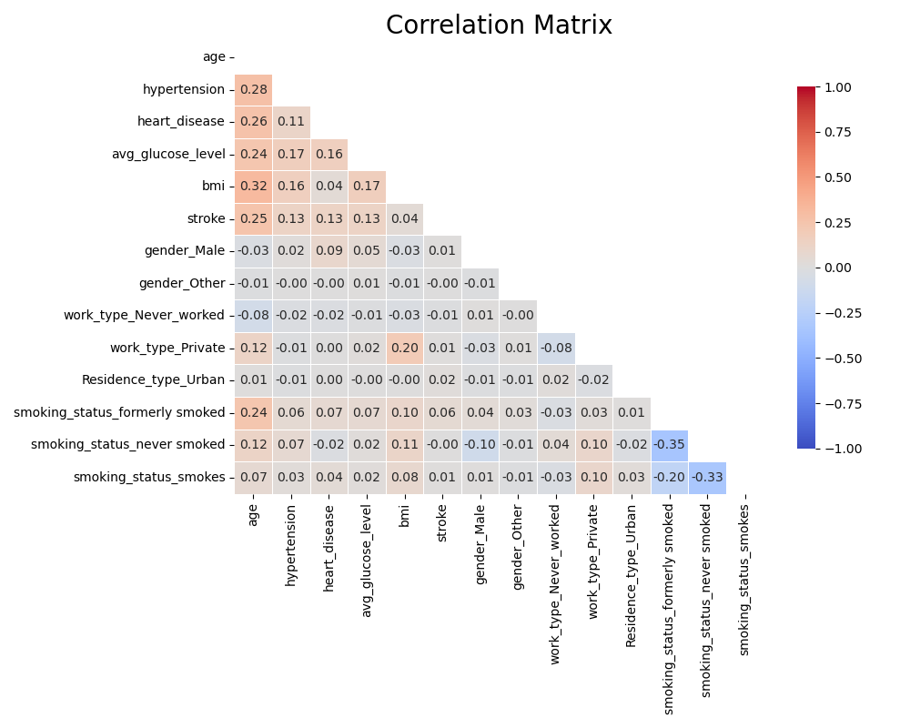
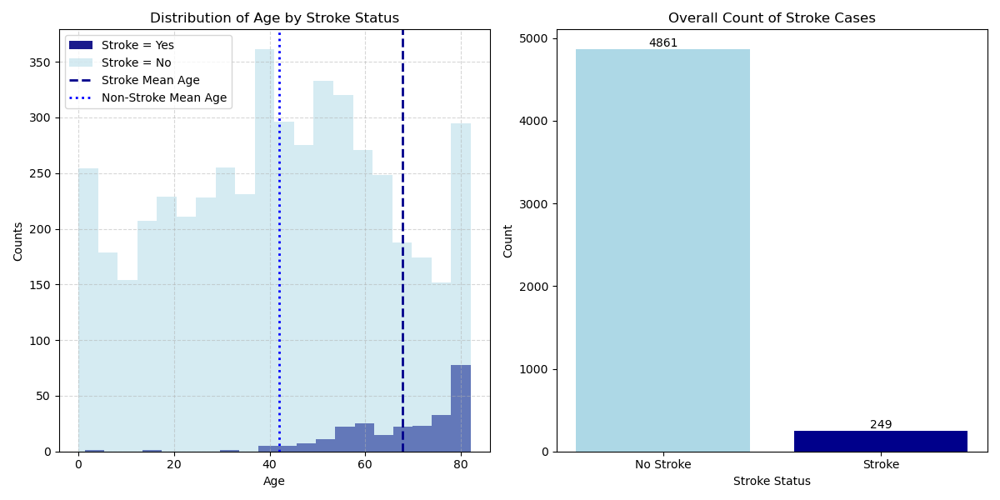
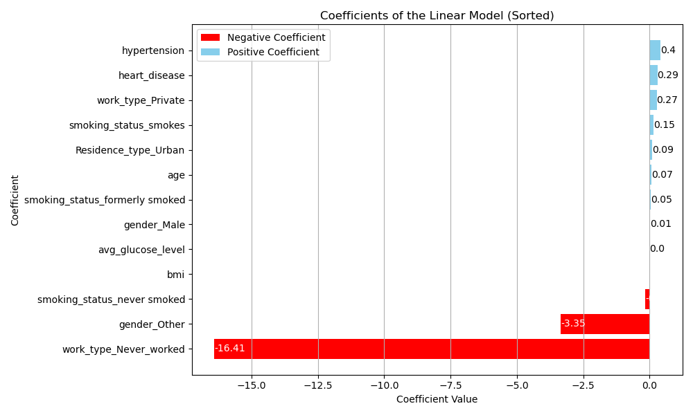

# Predicting Stroke Propensity
 

## Dataset

The dataset for this project can be found on [Kaggle](https://www.kaggle.com/datasets/fedesoriano/stroke-prediction-dataset)

## Objectives

The main objective of this project is:

> ** To clean and analyze the dataset and generate a logistic model to predict stroke propensity based on patient demographics.

To achieve this, the objectives are futher broken down into 3 sub-objectives
1. Main Insights: Perform exploratory data analysis of the dataset and report key findings
2. Model Training: Train a Logistic Model and analyze the significance and impact of its coefficients
3. Evaluation: Analyze the residuals and suggest model improvements

## Main Insights

During the exploratory data analysis (EDA), a slight positive correlation between age and stroke was revealed while exploring for multicollinearity. Age was also found to be slightly correlated with other ailments in the dataset, such as hypertension, heart disease, and BMI.



To further explore the relationship between stroke and age, histograms were utilized to visualize the distributions of the two groups. Additionally, a bar graph was employed to illustrate the counts of each group.



The histogram analysis indicates a visually distinct difference in the mean age between the two groups, with stroke victims generally exhibiting older ages compared to non-stroke victims. However, the bar graph highlights a limitation in the dataset, particularly the scarcity of observations pertaining to stroke cases. This dataset's imbalance may introduce a significant bias towards predicting the absence of stroke, potentially resulting in elevated false-negative predictions when the model is applied to new and unseen data.

A two-sample t-test was conducted to quantitatively assess the difference in means of age between stroke and non-stroke classes.

$H_0$: There is no difference between these two populations. $\mu_a = \mu_b$

$H_1$: There is a difference between these two populations. $\mu_a \neq \mu_b$

Significance Level $\alpha$ = 0.05

```shell
Stroke Mean Age: 67.73
Non-stroke Mean Age: 41.97
t_statistic: 18.08083426887953
p_value: 7.0307775129939774e-71
Reject the Null Hypothesis, the test is significant (p-value < 0.05)
```

The results of the t-test led to the rejection of the null hypothesis, providing strong evidence that age is a significant determinant of stroke. This implies that age will likely possess a high coefficient when training our logistic regression model.

## Model Training 

A logistic model was trained to predict medical insurance charges using the statsmodels library


```shell
	Coefficient	Z-Statistic	P-Value	P-value < 0.05	odds_ratio	VIF
age	0.070759	13.111353	2.834943e-39	Significant	1.073	6.694922
hypertension	0.404587	2.460286	1.388262e-02	Significant	1.499	1.205089
heart_disease	0.292121	1.533414	1.251740e-01	Not Significant	1.339	1.161208
avg_glucose_level	0.004061	3.399995	6.738713e-04	Significant	1.004	6.188126
bmi	-0.001324	-0.117977	9.060857e-01	Not Significant	0.999	10.439046
gender_Male	0.008921	0.063058	9.497203e-01	Not Significant	1.009	1.672654
gender_Other	-3.353043	-0.050460	9.597559e-01	Not Significant	0.035	1.002318
work_type_Never_worked	-16.405281	-0.000924	9.992627e-01	Not Significant	0.000	1.017193
work_type_Private	0.267173	1.884524	5.949407e-02	Not Significant	1.306	2.526406
Residence_type_Urban	0.091492	0.663227	5.071854e-01	Not Significant	1.096	1.935815
smoking_status_formerly smoked	0.045085	0.218489	8.270478e-01	Not Significant	1.046	1.858002
smoking_status_never smoked	-0.154715	-0.788922	4.301574e-01	Not Significant	0.857	2.574499
smoking_status_smokes	0.146531	0.634982	5.254398e-01	Not Significant	1.158	1.675731
```



